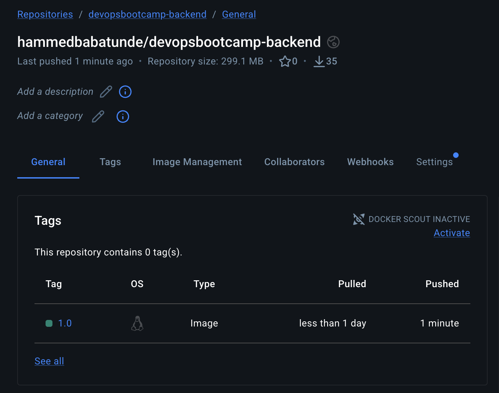
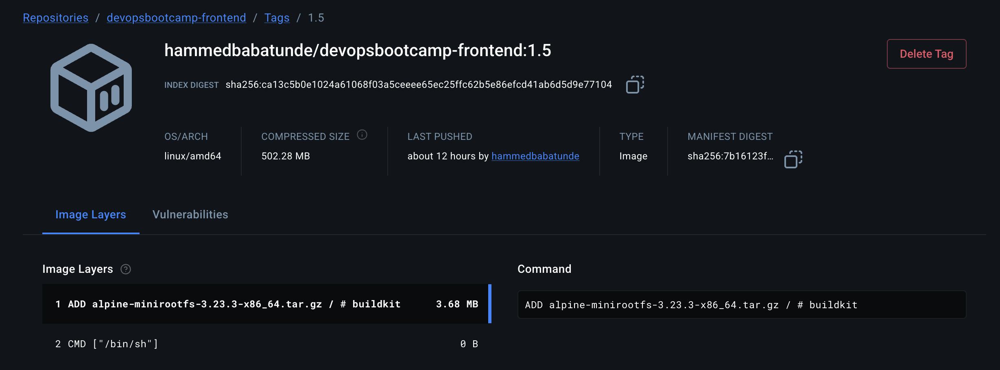
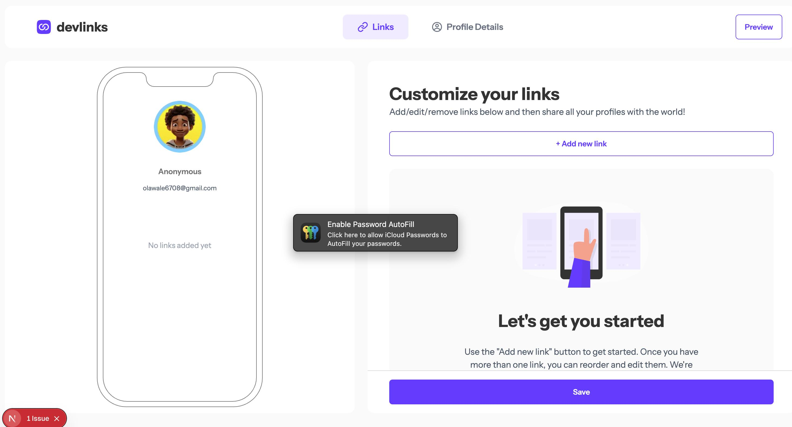
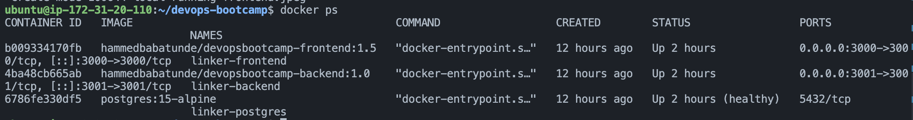

# Full-Stack Containerization & Deployment: DevLinks

**Platform:** AWS EC2 (Ubuntu 24.04)

**Project Goal:** My objective was to orchestrate a production-ready, three-tier web application using Docker Best Practices, multi-stage builds.

## My Dockerization Process

### How I Dockerized the Frontend (Next.js)

The frontend presented a unique challenge because Next.js "bakes" environment variables into static JavaScript files during the build process.

- Multi-Stage Build: I utilized a 4-stage process (Base → Deps → Build → Production). This allowed me to separate the heavy build environment from the slim runtime, successfully reducing the final image size by over 60%.

- Variable Injection: I implemented ARG NEXT_PUBLIC_API_URL to ensure the AWS Public IP was injected during the build. This was critical for allowing the client-side code to communicate with the API across different host environments.

- Runtime Binding: To avoid making code changes specifically for cloud deployment, I used a runtime override in the compose file (command: npx next start -H 0.0.0.0 -p 3000). This forced the application to listen on all network interfaces rather than just localhost.

### How I Dockerized the Backend using Multi-Stage Builds (NestJS & Prisma)

To dockerize the backend, I implemented a structured multi-stage build process to separate my development tools from the final production artifacts.

- Dependencies Stage: I used a dedicated stage to install packages using pnpm. By leveraging Docker’s layer caching, I ensured that my build times remained fast, as dependencies are only re-installed if the lockfile changes.

- Build Stage & Patching: During the build stage, I performed a "Build-Time Patch" using sed to inject // @ts-nocheck into the JWT service file. This was necessary to bypass complex type-inference errors that were blocking the production compilation. I also executed pnpm prisma generate here to prepare the ORM client.

- Production Stage & Stabilization: In the final production stage, I pinned npx prisma@6.19.2 specifically. I did this to ensure total binary compatibility with the Alpine Linux architecture and to prevent any breaking changes from newer Prisma versions.

- Security Hardening: I replaced the default root user with a dedicated nodejs system user. By using the USER directive, I followed the principle of least privilege to minimize the container's attack surface.

## Orchestration & Infrastructure
I managed the entire stack via app.yaml (Docker Compose), implementing Infrastructure as Code (IaC) principles.

- Service Discovery: I configured the Backend to connect to the database via internal Docker DNS (postgres:5432). This keeps database traffic isolated within the Docker network for better security.

- Health Modeling: I implemented a pg_isready health check on the PostgreSQL container. I then configured the Backend service to wait until the database reported as "Healthy" before booting to prevent startup crashes.

- Data Persistence: I defined a named volume (postgres_data) to ensure that user profiles and link data persist even if I destroy or update the containers.

## Essential CLI Commands
I used these commands to manage the lifecycle of the deployment, from building and pushing images to managing the live containers.

### Build & Registry Commands
| Action   | Command |
| -------- | ------- |
| Bake Frontend Image  | ` docker build --no-cache --build-arg NEXT_PUBLIC_API_URL=http://$PUBLIC_IP_ADDRESS:3001/api -t hammedbabatunde/devopsbootcamp-frontend:1.5 .  `  |
| Bake Backend Image | ` docker build -t hammedbabatunde/devopsbootcamp-backend:1.0 ./devops-bootcamp-linker-backend ` |
| Push Frontend to Hub    | ` docker push hammedbabatunde/devopsbootcamp-frontend:1.5 ` |
| Push Backend to Hub    | ` docker push hammedbabatunde/devopsbootcamp-backend:1.0 ` |

### Orchestration & Management
| Action   | Command |
| -------- | ------- |
| Start/Update Stack | ` docker compose -f app.yaml up -d`  |
| Check Backend Logs | ` docker logs -f linker-backend ` |
| Apply DB Migrations| ` docker exec -it linker-backend npx prisma@6.19.2 migrate deploy ` |
| Verify Internal Port| ` curl -I http://localhost:3000 ` |
| Inspect DB Tables | ` docker exec -it linker-postgres psql -U devuser -d linker_db -c "SELECT * FROM users;" ` |

## My Docker Hub Repositories
- Frontend: [hammedbabatunde/devopsbootcamp-frontend:1.5](https://hub.docker.com/repository/docker/hammedbabatunde/devopsbootcamp-frontend/tags/1.5/sha256:7b16123fe96f84572da3f60f96245820a988c036d59c4d908b368cf1b23a7af2)

- Backend: [hammedbabatunde/devopsbootcamp-backend:1.0](https://hub.docker.com/repository/docker/hammedbabatunde/devopsbootcamp-backend/tags/1.0/sha256-6ffff2bc6666080e06082791ea6e88e0c1496c7e1c2360948e2805580ac8174d)

## Final Verification Screenshots
1. Docker Hub Repository: (Screenshot showing my Hub repo with v1.5 and v1.0 images)

2. Application in Browser: (Screenshot of the live site running at http://13.61.134.145:3000)

3. Docker Process Status: (Screenshot of my docker ps output showing three healthy containers)

